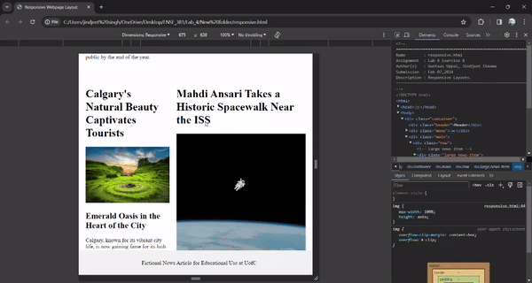
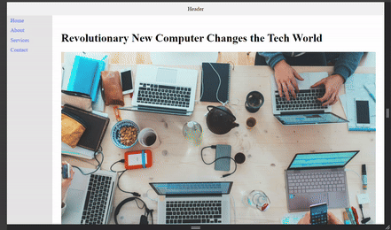

# Project Overview
After working with a basic HTML structure that included headers, footers, main content areas, news items, etc., we wrote CSS code to create a responsive webpage design. In our web development process, responsive design was a key factor that made sure web content looks great but also works on desktops, tablet, and smartphones.

## Team Members

|        Names        |
|---------------------|
|    Guntaas Uppal    |
|   Jindjeet Cheema   |

### Exercise B

### Exercise C

